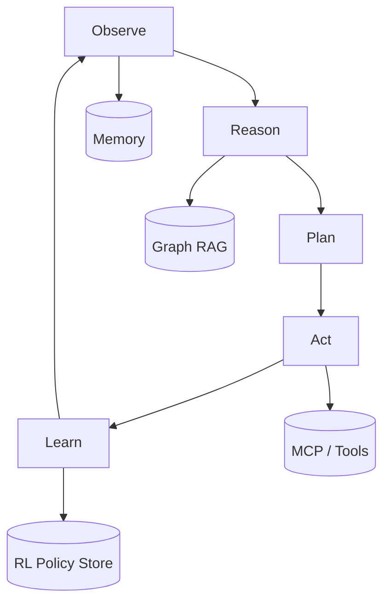
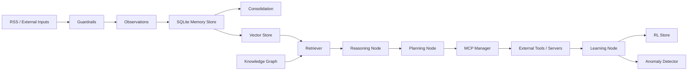

# Fractalmesh Agent Architecture

## Overview

Fractalmesh models an autonomous agent swarm built around a central async
orchestrator. The system combines agent lifecycle management, reinforcement
learning, memory consolidation, retrieval-augmented reasoning, RSS ingest,
MCP tool routing, and security controls. All components default to local
SQLite-backed persistence so the platform runs without mandatory external
services.

## Orchestration Flow

## Swarm Topology

- **Agents** provide runtime identities, roles, capabilities, and lifecycle state.
- **Registry** tracks active and persisted agents, making health state queryable.
- **Lifecycle controls** emit audit-friendly events for spawn, pause, resume,
  and termination.
- **Orchestrator** coordinates one control loop per cycle.
- **MCP manager** distributes tool execution across healthy servers with
  failover.
- **RL engine** helps the swarm balance exploration and exploitation.
- **Memory and RAG layers** preserve context and recover relevant knowledge.
- **Security controls** gate ingress, egress, and abnormal behavior.

## Module Breakdown

### `fractalmesh.config`
Central `pydantic-settings` configuration with environment and `.env`
support. Provides safe defaults for all optional integrations.

### `fractalmesh.agents`
- `core.py`: typed `Agent` dataclass.
- `registry.py`: in-memory plus SQLite persistence.
- `lifecycle.py`: evented state transitions.

### `fractalmesh.rl`
- `engine.py`: contextual bandit action selection with UCB and softmax exploration.
- `rewards.py`: EMA tracking, reward shaping, and regret accounting.
- `store.py`: policy and action persistence in SQLite.

### `fractalmesh.memory`
- `base.py`: canonical memory record schema.
- `sqlite_store.py`: CRUD and search with FTS5 fallback support.
- `vector_store.py`: local vector search plus optional Chroma integration.
- `consolidation.py`: episodic-to-semantic compression during pressure events.

### `fractalmesh.rag`
- `graph.py`: heuristic entity extraction and multi-hop graph traversal.
- `retriever.py`: ranking across vector similarity and graph connectivity.
- `embeddings.py`: deterministic local embeddings with provider abstraction.

### `fractalmesh.rss`
- `rotation.py`: weighted source selection, TTL gating, retry backoff, dedup.
- `processor.py`: RSS parsing, text extraction, summarization abstraction.
- `config.py`: environment, JSON, and OPML source management.

### `fractalmesh.mcp`
- `client.py`: typed client with timeout metadata and circuit breaker behavior.
- `manager.py`: healthy-server discovery, round-robin dispatch, failover.
- `registry.py`: persisted tool catalog.

### `fractalmesh.security`
- `guardrails.py`: PII redaction and command injection detection.
- `anomaly.py`: statistical anomaly detection on numeric streams.
- `rate_limit.py`: token-bucket protection per agent or tool key.

## Data Flow

## Security Model

1. **Input filtering** removes common PII and blocks likely command-injection
   attempts before content reaches planning or action layers.
2. **Output filtering** redacts sensitive strings before responses are emitted.
3. **Rate limiting** constrains per-agent and per-tool throughput with a local
   token-bucket model.
4. **Anomaly detection** flags suspicious deviations in action or reward streams.
5. **Circuit breakers** prevent repeatedly failing MCP servers from destabilizing
   the orchestrator.
6. **SQLite-first persistence** keeps default operation local and auditable.
